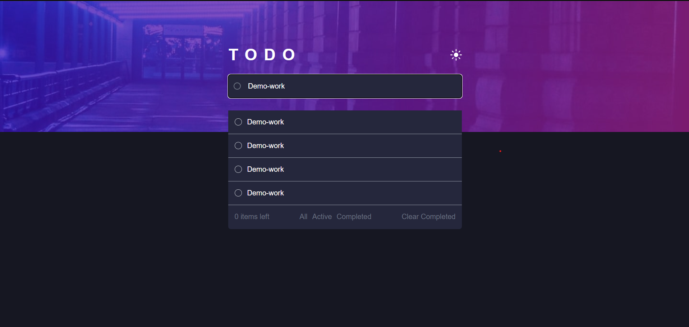

## Todo Web Application

Welcome to our Todo Web Application! This application provides a simple and intuitive interface for managing your daily tasks effectively. Whether you're organizing your work, planning your day, or keeping track of personal errands, our Todo Web Application has got you covered.



## Table of Contents

- [Features](#features)
- [Demo](#demo)
- [Technologies Used](#technologies-used)
- [Installation](#installation)
- [Usage](#usage)
- [Contributing](#contributing)
- [License](#license)

## Features

- **Add Todos**: Easily add new tasks to your todo list.
- **Remove Todos**: Remove tasks that are no longer needed.
- **Mark as Completed**: Mark tasks as completed when finished.
- **Filtering Options**: Filter todos based on their status (All, Active, Completed).
- **Clear Completed Todos**: Remove all completed tasks with a single click.
- **Responsive Design**: Enjoy a seamless experience across different devices.

## Technologies Used

- **React**: A JavaScript library for building user interfaces efficiently.
- **JavaScript (ES6+)**: Modern JavaScript syntax for writing clean and concise code.
- **TAILWIND**: A utility-first CSS framework for rapidly building custom designs.
- **HTML5**: The standard markup language for creating web pages and applications.
- **CSS3**: The style sheet language used for styling the application and making it visually appealing.
- **npm**: A package manager for JavaScript that simplifies the process of installing, managing, and updating dependencies.

## Installation

To run this application locally, follow these steps:

1. Clone the repository:

   ```bash
   git clone git@github.com:Firdous19/TODO.git
   ```

2. Navigate to the project directory:

   ```bash
   cd TODO
   ```

3. Install dependencies:

   ```bash
   npm install
   ```

## Usage

Once you've installed the dependencies, you can start the development server:

```bash
npm start
```

Open your web browser and navigate to [http://localhost:5173](http://localhost:5173) to view the Todo Web Application. You can now add, remove, and manage your todos efficiently!

## Contributing

We welcome contributions from the community! If you'd like to contribute to the project, please follow these guidelines:

1. Fork the repository.
2. Create a new branch (`git checkout -b feature/my-feature`).
3. Make your changes.
4. Commit your changes (`git commit -am 'Add new feature'`).
5. Push to the branch (`git push origin feature/my-feature`).
6. Create a new pull request.
